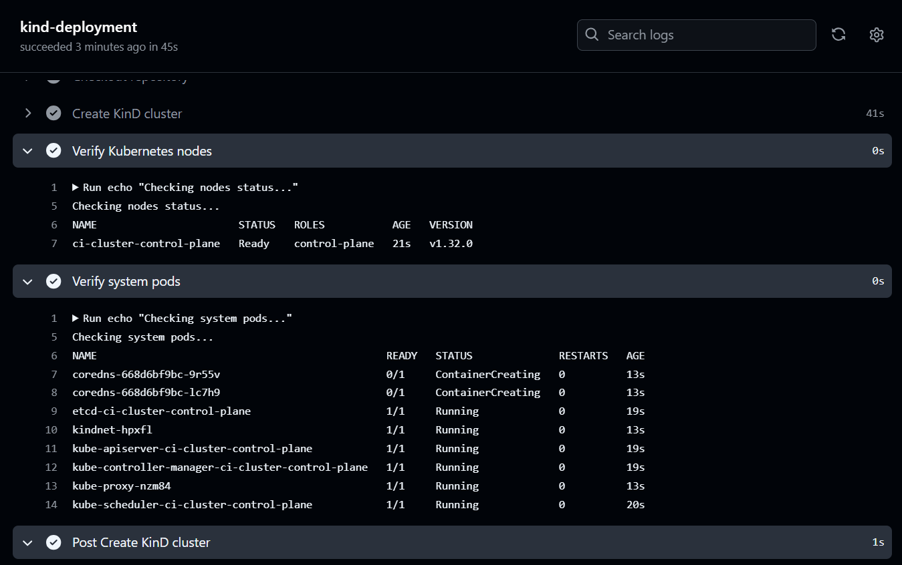
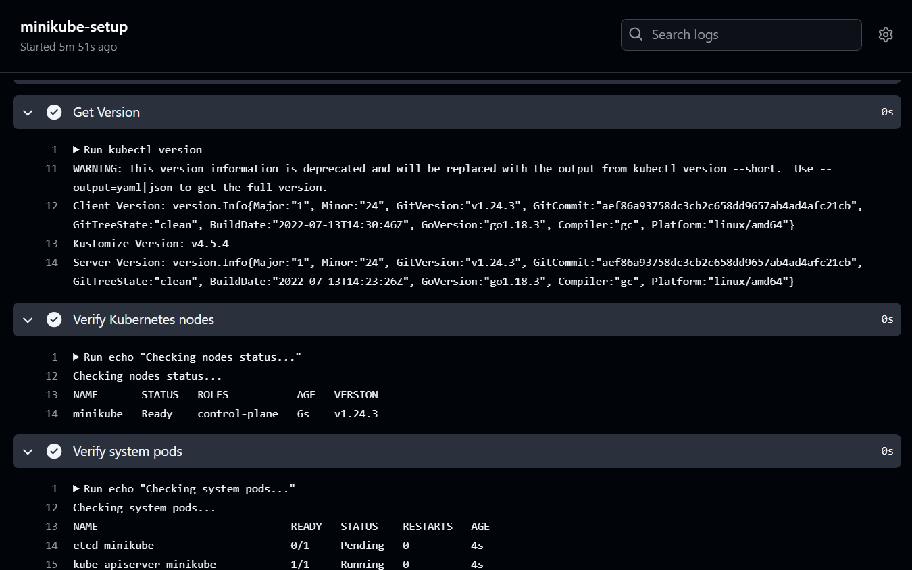

# 09. Kubernetes

## Homework Assignment 1: KinD Kubernetes Cluster Setup

### KinD install
```shell
misyukevich@misyukevich-VirtualBox:~$ [ $(uname -m) = x86_64 ] && curl -Lo ./kind https://kind.sigs.k8s.io/dl/v0.26.0/kind-linux-amd64
misyukevich@misyukevich-VirtualBox:~$ chmod +x ./kind
misyukevich@misyukevich-VirtualBox:~$ sudo mv ./kind /usr/local/bin/kind
misyukevich@misyukevich-VirtualBox:~$ kind --version
kind version 0.26.0
```
### Create a KinD cluster
```shell
misyukevich@misyukevich-VirtualBox:~$ kind create cluster --name my-kind-cluster
Creating cluster "my-kind-cluster" ...
 ✓ Ensuring node image (kindest/node:v1.32.0) 🖼
 ✓ Preparing nodes 📦
 ✓ Writing configuration 📜
 ✓ Starting control-plane 🕹️️️️️️️️️️️️️️️️️️️️️️️️️️️️️️️️️️️️️️️️️️️️️️️️️️️️️️️️️️️️️️️️️️️️️️️️️️️️️️️️️️️️️️️️️️️️️️️️️️️️️️️️️️️️️️️️️️️️️️️️️️️️️️️️️️️️️️️️️️️️️️️️️️️️️️️️️️️️️️️️️️️️️️️️️️️️️️️️️️️️️️️️️️️️️️️️️️️️️️️️️️️️️️️️️️️️️️️️️️️️️️️️️️️️️️️️️️️️️️️️️️️️️️️️️️️️️️️️️️️️️️️️️️️️️️️️️️️️️️️️️️️️️️️️️️️️️️️️️️️️️️️️️️️️️️️️️️️️️️️️️️️️️️️️️️️️️️️️️️️️️️️️️️️️️️️️️️️️️️️️️️️️️️️️️️️️️️️️️️️️️️️️️️️️️️️️️️️️️️️️️️️️️️️️️️️️️️️️️️️️️️️️️️️️️️️️️️️️️️️️️️️️️️️️️️️️️
 ✓ Installing CNI 🔌
 ✓ Installing StorageClass 💾
Set kubectl context to "kind-my-kind-cluster"
You can now use your cluster with:

kubectl cluster-info --context kind-my-kind-cluster

Have a question, bug, or feature request? Let us know! https://kind.sigs.k8s.io/#community 🙂

```

### Verify cluster
```shell
misyukevich@misyukevich-VirtualBox:~$ kubectl cluster-info --context kind-my-kind-cluster
Kubernetes control plane is running at https://127.0.0.1:40319
CoreDNS is running at https://127.0.0.1:40319/api/v1/namespaces/kube-system/services/kube-dns:dns/proxy

To further debug and diagnose cluster problems, use 'kubectl cluster-info dump'.

misyukevich@misyukevich-VirtualBox:~$ kubectl get node
NAME                            STATUS   ROLES           AGE     VERSION
my-kind-cluster-control-plane   Ready    control-plane   2m17s   v1.32.0

misyukevich@misyukevich-VirtualBox:~$ kubectl get pods -A
NAMESPACE            NAME                                                    READY   STATUS    RESTARTS   AGE
kube-system          coredns-668d6bf9bc-92wfz                                1/1     Running   0          2m45s
kube-system          coredns-668d6bf9bc-lj2qd                                1/1     Running   0          2m45s
kube-system          etcd-my-kind-cluster-control-plane                      1/1     Running   0          2m56s
kube-system          kindnet-vhhgr                                           1/1     Running   0          2m46s
kube-system          kube-apiserver-my-kind-cluster-control-plane            1/1     Running   0          2m53s
kube-system          kube-controller-manager-my-kind-cluster-control-plane   1/1     Running   0          2m58s
kube-system          kube-proxy-4d9fx                                        1/1     Running   0          2m46s
kube-system          kube-scheduler-my-kind-cluster-control-plane            1/1     Running   0          2m50s
local-path-storage   local-path-provisioner-58cc7856b6-s7lrg                 1/1     Running   0          2m43s

```

## Homework Assignment 2: Minikube Kubernetes Cluster Setup

### Minikube install
```shell
misyukevich@misyukevich-VirtualBox:~$ curl -Lo minikube https://storage.googleapis.com/minikube/releases/latest/minikube-linux-amd64 \
  && chmod +x minikube
sudo install minikube /usr/local/bin/
```
### Creating cluster
```shell
misyukevich@misyukevich-VirtualBox:~$ minikube start --vm-driver=docker
* minikube v1.35.0 на Ubuntu 24.04 (vbox/amd64)
  - KUBECONFIG=/home/misyukevich/.kube/config-k8s:/home/misyukevich/.kube/config-k3s
* Используется драйвер docker на основе конфига пользователя
* Using Docker driver with root privileges
* Starting "minikube" primary control-plane node in "minikube" cluster
* Pulling base image v0.0.46 ...
* Скачивается Kubernetes v1.32.0 ...
    > preloaded-images-k8s-v18-v1...:  333.57 MiB / 333.57 MiB  100.00% 1.81 Mi
    > gcr.io/k8s-minikube/kicbase...:  500.31 MiB / 500.31 MiB  100.00% 2.42 Mi
* Creating docker container (CPUs=2, Memory=2200MB) ...
* Подготавливается Kubernetes v1.32.0 на Docker 27.4.1 ...
  - Generating certificates and keys ...
  - Booting up control plane ...
  - Configuring RBAC rules ...
* Configuring bridge CNI (Container Networking Interface) ...
* Компоненты Kubernetes проверяются ...
  - Используется образ gcr.io/k8s-minikube/storage-provisioner:v5
* Включенные дополнения: default-storageclass, storage-provisioner
* Готово! kubectl настроен для использования кластера "minikube" и "default" пространства имён по умолчанию

```
### Checking cluster
```shell
misyukevich@misyukevich-VirtualBox:~$ minikube status
minikube
type: Control Plane
host: Running
kubelet: Running
apiserver: Running
kubeconfig: Configured

misyukevich@misyukevich-VirtualBox:~$ kubectl get node
NAME       STATUS   ROLES           AGE     VERSION
minikube   Ready    control-plane   5m15s   v1.32.0

misyukevich@misyukevich-VirtualBox:~$ kubectl get pods -A
NAMESPACE     NAME                               READY   STATUS    RESTARTS        AGE
kube-system   coredns-668d6bf9bc-wt525           1/1     Running   0               5m39s
kube-system   etcd-minikube                      1/1     Running   0               5m51s
kube-system   kube-apiserver-minikube            1/1     Running   0               5m51s
kube-system   kube-controller-manager-minikube   1/1     Running   0               5m51s
kube-system   kube-proxy-ls6vv                   1/1     Running   0               5m39s
kube-system   kube-scheduler-minikube            1/1     Running   0               5m51s
kube-system   storage-provisioner                1/1     Running   1 (5m32s ago)   5m37s
```
## Homework Assignment 3: GitHub Actions for KinD Cluster Setup

[Action](https://github.com/Misyukevich/09_Kubernetes/actions/workflows/kind-cluster.yaml)

[Workflow](./.github/workflows/kind-cluster.yaml)

### Cluster Details




## Homework Assignment 4: GitHub Actions for Minikube Cluster Setup

[Action](https://github.com/Misyukevich/09_Kubernetes/actions/workflows/minikube-cluster.yaml)

[Workflow](./.github/workflows/minikube-cluster.yaml)

### Cluster Details




